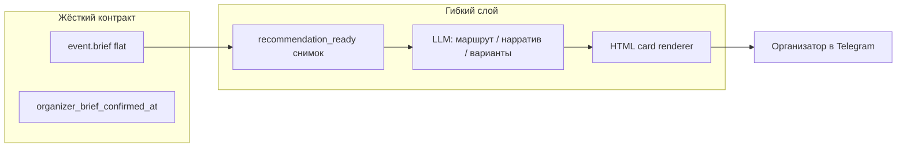

# Архитектура опыта после брифа

**Принцип продукта:** жёстко фиксируем только **согласованный бриф** (`organizer_brief_confirmed_at` + канон `event.brief`).  
Всё, что идёт после — **динамический слой**: LLM + **кастомные HTML-карточки** в Telegram, без жёстких rules-шаблонов как целевой дизайн.

Связанные документы: [`TRIP_FROM_BRIEF_SPEC.md`](TRIP_FROM_BRIEF_SPEC.md), [`TRIP_ROUTE_COMPOSITION.md`](TRIP_ROUTE_COMPOSITION.md), [`TRIP_DATA_SOURCES.md`](TRIP_DATA_SOURCES.md), [`RECOMMENDATION_BRIEF_SCHEMA.md`](RECOMMENDATION_BRIEF_SCHEMA.md).

---

## 1) Два слоя системы

| Слой | Что фиксируем | Что не фиксируем заранее |
|------|----------------|-------------------------|
| **Контракт** | Факты из диалога: состав, даты/окна, бюджет, направления/регионы, **любые способы передвижения** (перелёт, машина, поезд, паром, лодка, пешком, … — см. [`TRIP_TRANSPORT_MODEL.md`](TRIP_TRANSPORT_MODEL.md)), стиль, must-visit, комбо, конфликты | Порядок стран/точек, детали рейсов/расписаний, цены |
| **Динамика** | — | 2–3 **сценария поездки**, **маршрут по сегментам**, **нарратив** (погода, логика перемещений), следующий шаг без брони |

**Текущий код** (`trip_from_brief.generate_draft_proposals` — rules-шаблоны) — **временная заглушка** для проверки gates и полей события. Целевой путь: [`trip_proposal_pipeline.py`](../../bot/src/trip_proposal_pipeline.py) + промпт + **card templates**, не дублирование продуктовой логики в Python-if.

---

## 2) Воронка: не «быстро к бронированию»

Ранний backlog («brief → карточки + partner-link») **сознательно отложен**. После брифа пользователь проходит **объясняющий** путь, а не checkout.

| Этап | Смысл | Handoff |
|------|--------|---------|
| A. Бриф согласован | единственный жёсткий checkpoint | — |
| B. Сценарии (2–3) | «как вообще можно собрать поездку» | LLM + карточка `scenario` |
| C. Маршрут выбранного сценария | сегменты, перемещения, наполнение | карточка `route_plan` |
| D. Нарратив / «что расскажем» | почему так, погода, география, впечатления | карточка `story` |
| E. Уточнения / short-list | один сценарий, открытые вопросы группы | inline + supplement брифа |
| F. Мониторинг цен / ссылки | **только после** E, с дисклеймером | Travelpayouts и т.д. (v2+) |
| G. Бронирование | вне бота или deep-link | не обещаем из чата |

**Запрещено в UX этапов B–E:** кнопки «Забронировать», «Лучшая цена», имитация оплаты.  
Допустимо: «Сохранить вариант», «Обсудить с группой», «Уточнить даты», «Показать другой порядок стран».

См. расширенный flow: [`TRIP_PROPOSAL_USER_FLOW.md`](TRIP_PROPOSAL_USER_FLOW.md).

---

## 3) LLM + HTML-карточки (целевой UI)

### 3.1 Роли LLM

1. **Planner** — из `recommendation_ready` + `content_brief` строит структуру: сценарии, сегменты маршрута, порядок точек (см. [`TRIP_ROUTE_COMPOSITION.md`](TRIP_ROUTE_COMPOSITION.md)).
2. **Narrator** — «что рассказываем»: сезон, логика перемещений, связка с полями брифа (`stay_experience`, `activity_preferences`, `must_visit`, merger-conflicts).
3. **Editor** — сжимает в блоки под **тип карточки** (лимиты Telegram, без полотна).

Rules в коде — только **валидация JSON**, **блокеры readiness**, **рендер карточек**, не генерация смысла поездки.

### 3.2 Типы HTML-карточек (черновик контракта)

| `card_type` | Когда показываем | Ключевые блоки |
|-------------|------------------|----------------|
| `readiness_blocked` | не хватает данных **по заявленным режимам** в брифе | не спрашивать перелёт, если в брифе только машина/лодка/пешком |
| `scenario_compare` | этап B | 2–3 заголовка, fit, tradeoffs, теги |
| `route_segment` | этап C | точка / регион / страна, дни, как едем, что делаем |
| `route_overview` | после сегментов | карта словами: порядок, логика (Италия → Хорватия → Франция) |
| `story` | этап D | погода, «почему такой порядок», must-see, цитата из брифа |
| `group_note` | конфликты merger | что согласовать до любых ссылок |
| `next_step` | всегда в конце | один CTA: уточнить / другой сценарий / short-list |

Рендер: отдельный модуль (план: `trip_card_renderer.py`) — шаблоны HTML + escape, единый стиль с [`bot-message-formatting`](../../.cursor/rules/bot-message-formatting-global.mdc).

### 3.3 Что передаём в промпт

- **`recommendation_ready`** — структурированный снимок (см. схему).
- **`content_brief`** — агрегат «богатого» контекста из брифа для нарратива (§4 в [`RECOMMENDATION_BRIEF_SCHEMA.md`](RECOMMENDATION_BRIEF_SCHEMA.md)): не сырой `organizer_dump` целиком, а нормализованные списки впечатлений, регионов, стиля, цитаты участников.
- **`retrieved_facts`** (опционально) — короткие факты из открытых источников (§ в [`TRIP_DATA_SOURCES.md`](TRIP_DATA_SOURCES.md)): координаты, сезон, расстояния — с пометкой `source_id`.

---

## 4) Транспорт и readiness — мультимодальный бриф

В брифе может быть **любая комбинация** способов передвижения. Канон: [`TRIP_TRANSPORT_MODEL.md`](TRIP_TRANSPORT_MODEL.md).

| Идея | Реализация |
|------|------------|
| Источник истины | текст и поля брифа → `transport.modes_present[]` |
| Не бинарный «перелёт/наземка» | `flight`, `car`, `train`, `ferry`, `boat_private`, `walk`, `bus`, … |
| Readiness | отдельные блокеры **только для режимов, уже упомянутых** (`missing_flight_constraints`, `missing_drive_constraints`, …) |
| Маршрут | у каждого сегмента/перехода свой `movement.mode` |

Примеры:

- **Иваново + Городец:** `car` + `walk` — не спрашивать перелёт.
- **FR/IT/HR:** `flight` (вход) + `ferry`/`car`/`train` между странами — блокеры по входному перелёту и заметкам на стыках, не «часы перелёта» на весь маршрут.
- **Острова на лодке:** `boat_private` + `walk` — `missing_marine_notes`, если нет ни одной заметки; перелёт не обязателен.

`trip_transport` flight/ground в парсере — **legacy для карточки брифа**, не единственный gate post-brief.

---

## 5) Использование «богатого» брифа

Мы уже спрашиваем много — это **топливо для Narrator**, не шум:

| Поле брифа | Как использовать в карточках |
|------------|------------------------------|
| `months` / `date_range_raw` | окно сезона, «конец августа удобнее…» |
| `stay_experience.setting` | привязка к регионам/берегу |
| `activity_preferences` | впечатления, комбо стран, хобби |
| `must_visit_places` / `regions` | якоря маршрута |
| `participant_preferences` | разный комфорт перелёта → сегменты или tradeoffs |
| `group_conflicts` | блок `group_note`, не скрывать |
| merger `organizer_update_text` | что учли от участников |

**Пример (Хорватия + Франция + Италия):** Narrator объясняет порядок **Италия → Хорватия → Франция** (вход в конце августа, погода, географическая цепочка, плотность «must-see»), а Planner раскладывает **сегменты перемещения и наполнения** — не одна карточка «страна».

**Пример (Ивановская область, Городец):** archetype `impression_domestic` — маршрут по **точкам впечатлений**, без перелёта; карточки `route_segment` по локациям из брифа.

---

## 6) Открытые данные (кратко)

LLM **не заменяет** справочник: факты о местах, сезонах, расстояниях — из **retrieval** с цитированием `source_id`.  
Полный перечень и политика галлюцинаций: [`TRIP_DATA_SOURCES.md`](TRIP_DATA_SOURCES.md).

Цены и наличие билетов — **отдельный слой F**, не смешивать с черновиком маршрута.

---

## 7) Флаги и этапы внедрения

| Флаг | Назначение |
|------|------------|
| `TRIP_PROPOSALS_ENABLED` | показ post-brief flow |
| `TRIP_PROPOSALS_LLM_ENABLED` | Planner/Narrator вместо rules |
| `TRIP_CARD_NARRATIVE_ENABLED` | этап D (`story` карточки) |
| `TRIP_EXTERNAL_FACTS_ENABLED` | retrieval из открытых API |

---

## 8) Расхождение «док ↔ код» (явно)

| Документ / цель | Код сейчас |
|-----------------|------------|
| LLM + карточки | rules в `trip_from_brief._template_proposals` |
| Воронка B→E | шаги 13–15, почти сразу «варианты» |
| один `missing_transport` | заменить на блокеры по `modes_present` (TRIP_TRANSPORT_MODEL §5) |
| Маршрут по сегментам | нет `route_plan` в event |

Roadmap фазы D: сначала схема + readiness по archetype, затем LLM+cards, затем external facts, затем Travelpayouts.
