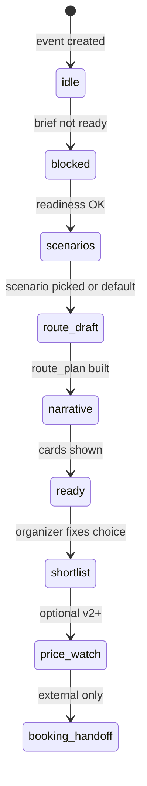

# Поездка на основании брифа — продуктовая и техническая спека

**Этап после** подтверждённого брифа (`organizer_brief_confirmed_at`): из согласованных вводных — **сценарии, маршрут по сегментам, нарратив**, затем short-list. **Не** быстрый переход к бронированию.

> **Архитектура (обязательно к прочтению):** жёстко фиксируется только бриф; дальше — **LLM + кастомные HTML-карточки**. См. [`TRIP_EXPERIENCE_ARCHITECTURE.md`](TRIP_EXPERIENCE_ARCHITECTURE.md).

Не путать с «Создать поездку» в меню — это **событие/сессия**; здесь — **продуктовое предложение** (как ехать / что увидеть), не новый `event`.

## 1) Job и границы

**Job организатора:** «Бриф согласован — хочу понять **как собрать поездку**: порядок стран/точек, что расскажем группе, почему так удобно — без выдуманных цен и брони».

| В scope (целевой продукт) | Вне scope |
|---------------------------|-----------|
| Снимок `recommendation_ready` + `content_brief` | Бронирование, оплата в чате |
| LLM: 2–3 **сценария** + `route_plan` по сегментам | Rules-шаблоны как финальная логика |
| HTML-карточки: scenario / route / story | «Купить сейчас» на черновике |
| Нарратив из полей брифа + открытые факты | Гарантии погоды и точного расписания |
| Short-list одного сценария | Автозамена брифа без supplement |

| Временно в коде (v0) | Статус |
|---------------------|--------|
| `generate_draft_proposals()` rules | заглушка, заменить на LLM |
| Шаги 13–15 без этапов C–D | расширить flow |

## 2) Предусловия (gates)

1. **`organizer_brief_confirmed_at`** — единственный жёсткий продуктовый gate.
2. **`readiness.ready`** — по **типу поездки** (`trip_archetype`), не универсальный «перелёт всем». См. [`RECOMMENDATION_BRIEF_SCHEMA.md`](RECOMMENDATION_BRIEF_SCHEMA.md) §4, [`TRIP_ROUTE_COMPOSITION.md`](TRIP_ROUTE_COMPOSITION.md).
3. Merger-сводка принята — рекомендация, не блокер v1.

**Readiness по транспорту:** только для режимов из `transport.modes_present` (перелёт, машина, поезд, паром, лодка, пешком, …). См. [`TRIP_TRANSPORT_MODEL.md`](TRIP_TRANSPORT_MODEL.md). Перелёт не спрашивать, если в брифе его нет.

## 3) Жизненный цикл (расширенный)



| Статус | Смысл |
|--------|--------|
| `idle` | бриф не подтверждён |
| `blocked` | не хватает данных для **данного** archetype |
| `scenarios` | 2–3 сценария (LLM) |
| `route_draft` | есть `route_plan` |
| `narrative` | есть `narrative_blocks` / story card |
| `ready` | организатор прошёл карточки |
| `shortlist` | выбран `proposal_id` |
| `price_watch` | Travelpayouts / алерты (backlog) |

Упрощённый mapping в коде v0: `draft` ≈ scenarios, `ready` ≈ показали карточки.

## 4) Поток в Telegram

См. [`TRIP_PROPOSAL_USER_FLOW.md`](TRIP_PROPOSAL_USER_FLOW.md) (шаги 13–18).

Фичефлаг: `TRIP_PROPOSALS_ENABLED` (по умолчанию **выкл.**).

## 5) Архитектура кода (целевая)

```
event.brief  ──► build_recommendation_ready()
              ──► build_content_brief()          # богатый контекст для LLM
              ──► assess_trip_readiness(archetype)
              ──► trip_facts_retrieval (optional)  # TRIP_DATA_SOURCES.md
              ──► trip_proposal_pipeline (LLM)
                    Planner  → route_plan, scenarios
                    Narrator → narrative_blocks
              ──► trip_card_renderer → HTML в Telegram
```

| Модуль | Роль |
|--------|------|
| `trip_from_brief.py` | снимок, readiness, **временные** rules-черновики |
| `trip_proposal_pipeline.py` | LLM Planner + Narrator |
| `trip_facts_retrieval.py` | план: Nominatim, OSRM, Open-Meteo… |
| `trip_card_renderer.py` | план: HTML по `card_type` |
| `prompts/trip_proposal_system_prompt.md` | контракт JSON для LLM |
| `main.py` | callbacks, без UX брони |

Детали маршрута: [`TRIP_ROUTE_COMPOSITION.md`](TRIP_ROUTE_COMPOSITION.md).  
Данные: [`TRIP_DATA_SOURCES.md`](TRIP_DATA_SOURCES.md).

## 6) Интеграция с брифом

- `must_visit`, `regions`, комбо стран → сегменты `route_plan`.
- `stay_experience`, `activity_preferences` → наполнение и `story`.
- `participant_preferences`, `group_conflicts` → tradeoffs и `group_note`.
- `organizer_dump` — provenance, в LLM только через `content_brief`.

## 7) Этапы внедрения

| # | Что |
|---|-----|
| 1 | Документация + `content_brief`, readiness по archetype |
| 2 | LLM scenarios + HTML `scenario_compare` |
| 3 | `route_plan` + карточки сегментов |
| 4 | Narrator + `story`, retrieval v1 (гео) |
| 5 | Short-list UI |
| 6 | Travelpayouts только на short-list |

## 8) Метрики

- `recommendation_ready_built`, `trip_archetype_detected`
- `trip_scenarios_generated`, `route_plan_generated`, `narrative_generated`
- `trip_card_viewed` по `card_type`
- `trip_proposal_selected` → позже `price_watch_started`

## 9) UX-ограничения

- Черновик: **«без проверки цен и брони»**.
- Не обещать бронь без API и явного этапа F.
- При конфликтах группы — карточка `group_note`.
- Тексты кнопок/карточек — с UX-апрувом перед продом.
