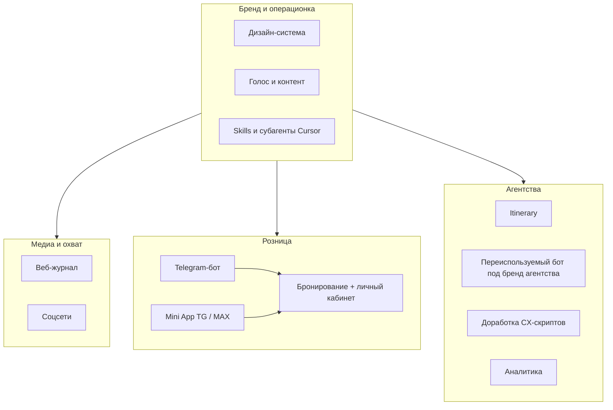

# MyTravel.Lab — видение платформы

> **Статус:** стратегический черновик (источник — продуктовое видение основателя).  
> **Обновлять**, когда появляются новые каналы, B2B-линейки или решения по дизайн-системе.

## В одной фразе

**MyTravel.Lab** — многофункциональная travel-платформа для **турагентств** и **розничных клиентов**: единый бренд, выдержанный контент и UX на разных поверхностях, с ядром в цифровых сервисах (бот, mini app, веб) и медиа (журнал, соцсети).

---

## Аудитории

| Сегмент | Кто | Главная ценность |
|---------|-----|------------------|
| **Розница (B2C)** | Семьи, друзья, организатор поездки в чате | Согласовать поездку, бриф, бронирование, «личный кабинет» в привычных мессенджерах |
| **Агентства (B2B)** | Небольшие турагентства, отели (см. B2B PRD) | Itinerary, white-label бот, CX-скрипты, аналитика, операционная эффективность |

Один бренд **MyTravel.Lab**, разные продуктовые «рельсы» с общей дизайн-системой и тоном.

---

## Карта платформы (логические блоки)

---

## Поверхности и сервисы

### Медиа и коммуникации

| Поверхность | Роль | Статус в репо |
|-------------|------|----------------|
| **Веб-журнал** | Экспертиза, SEO, доверие, воронка в продукт | Не начат (см. гипотезу лендинга/сайта отдельно) |
| **Соцсети** | Охват, форматы, репосты из журнала/кейсов | Не в коде; контент — через marketing skill |

### Розница (B2C)

| Поверхность | Роль | Статус в репо |
|-------------|------|----------------|
| **Telegram-бот** | Сбор брифа, участники, приглашения, сценарий «групповая поездка» | **В разработке** — `bot/`, [Family travel bot](../Family%20travel%20bot/README.md) |
| **Mini App** (Telegram / MAX) | Визуальный UI: варианты, бриф, кабинет | В backlog ([анализ рынка](../Family%20travel%20bot/Рынок%20и%20исследования/Анализ_рынка_и%20конкурентов.md)) |
| **Бронирование + ЛК** | Единый сервис заказов/статусов для розницы | Не начат; бот сейчас без полноценного ЛК |

### Агентства (B2B)

| Сервис | Роль | Статус в репо |
|--------|------|----------------|
| **Красивые itinerary** | Презентабельные маршруты для клиента агентства | Не начат (продуктовая линия) |
| **White-label бот** | Бот под бренд/процессы агентства | Черновик направления — [B2B PRD](../B2B%20bot%20agencies/PRD_B2B_bot_agencies_hotels.md) |
| **CX-скрипты** | Улучшение сценариев ответов, шаблонов | В B2B гипотезах |
| **Аналитика** | VoC, переписки, отзывы, метрики | В B2B гипотезах |
| *Дальше* | Новые модули по мере валидации | — |

---

## Сквозные «фундаменты» (без них платформа расползается)

### 1. Дизайн-система

- Один набор **foundations** (цвет, тип, сетка, компоненты) для: журнал, соцшаблоны, веб, mini app, PDF/itinerary, письма.
- **Голос** уже частично зафиксирован: [BOT_PERSONA.md](../Family%20travel%20bot/BOT_PERSONA.md) (ты, женский род, спокойный тон) → расширить в **Brand voice** для всех каналов.
- Артефакт: `docs/design-system/` (планируется) + токены в коде при появлении веба.

### 2. Контент

- Журнал + соцсети + тексты бота + B2B-материалы из **одной редакционной логики**.
- Skills: `marketing-content-creator`, позже — дайджест/курация источников.

### 3. Cursor: skills и субагенты

Инструменты **разработки и операционки** в этом репозитории, не runtime продукта для пользователя.

| Назначение | Примеры |
|------------|---------|
| Исследования | `product-trend-researcher` |
| Контент | `marketing-content-creator` |
| Курация статей | *планируется* — skill дайджеста по whitelist-источникам |
| Код бота / CI | правила в `.cursor/rules/` |

Карта: [CURSOR_CAPABILITIES_MAP.md](./CURSOR_CAPABILITIES_MAP.md).

---

## Что сейчас vs что потом

| Слой | Сейчас (репозиторий) | Следующие горизонты |
|------|----------------------|---------------------|
| Продукт | MVP Telegram-бот, групповой бриф | Mini App, рекомендации, short-list |
| B2B | PRD/SPEC, гипотезы | Пилот с агентством, itinerary |
| Медиа | — | Журнал v0, соц-ритм |
| Платформа | Файловое хранилище событий | БД, auth, единый ЛК |
| Бренд | BOT_PERSONA, UX-копи | Полная design system |

**Важно:** текущий код в `bot/` — **первый клин** розничной линии (Family travel / групповой бриф), а не вся платформа. Не смешивать scope MVP с обещаниями журнала и B2B в пользовательских текстах без явного включения фичи.

---

## Этапы эволюции (без дат)

1. **Клин A — Telegram-бот розницы** — бриф, участники, приглашения (текущий фокус).
2. **Фундамент бренда** — design system v0, голос, шаблоны соц/журнал.
3. **Медиа** — журнал + связка с ботом (CTA, deeplink).
4. **Mini App + ЛК** — визуал и бронирование для розницы.
5. **B2B-модули** — itinerary, white-label бот, CX/аналитика.
6. **Платформа** — общие аккаунты, API, аналитика сквозь каналы.

Порядок 2–6 уточняется по PMF и ресурсам; документ можно переставлять.

---

## Связанные документы в репозитории

| Тема | Путь |
|------|------|
| MVP розницы | `docs/Family travel bot/` |
| B2B агентства | `docs/B2B bot agencies/` |
| Гипотезы и идеи | `docs/ideas/` |
| Рынок | `docs/Family travel bot/Рынок и исследования/` |
| Деплой бота | `bot/README.md`, `bot/RAILWAY_PROJECT.md` |
| Skills Cursor | `.cursor/skills/` |

---

## Открытые решения (заполнять по мере прояснения)

- [ ] Приоритет после MVP-бота: журнал vs mini app vs B2B пилот
- [ ] Домен и единый вход (SSO / Telegram-only)
- [ ] MAX vs только Telegram для mini app
- [ ] Монетизация по сегментам (подписка B2B, комиссия B2C, …)
- [ ] Источники и ритм контент-дайджеста (для будущего curation skill)

*Дополнительный контекст от основателя добавлять в этот раздел или в отдельные ADR в `docs/MyTravel.Lab/decisions/`.*
